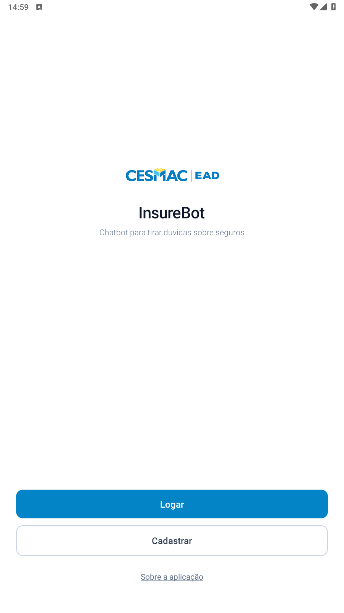
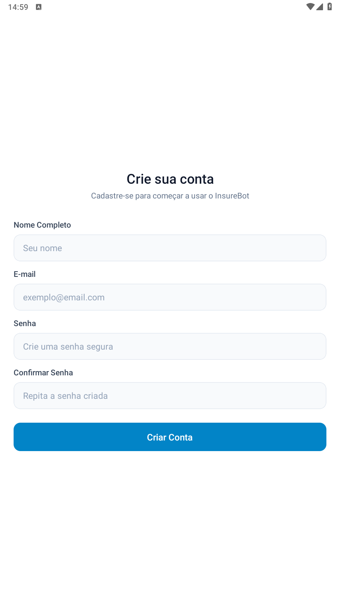
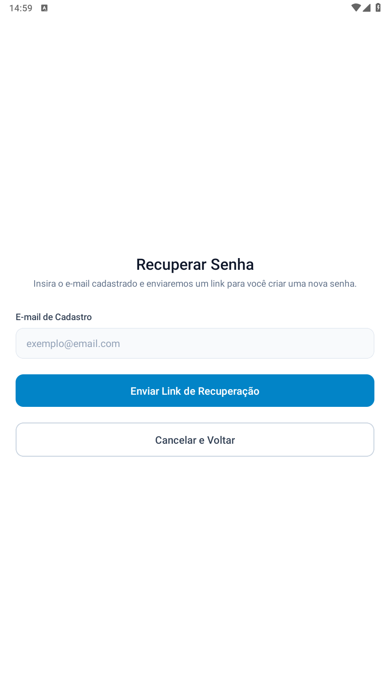
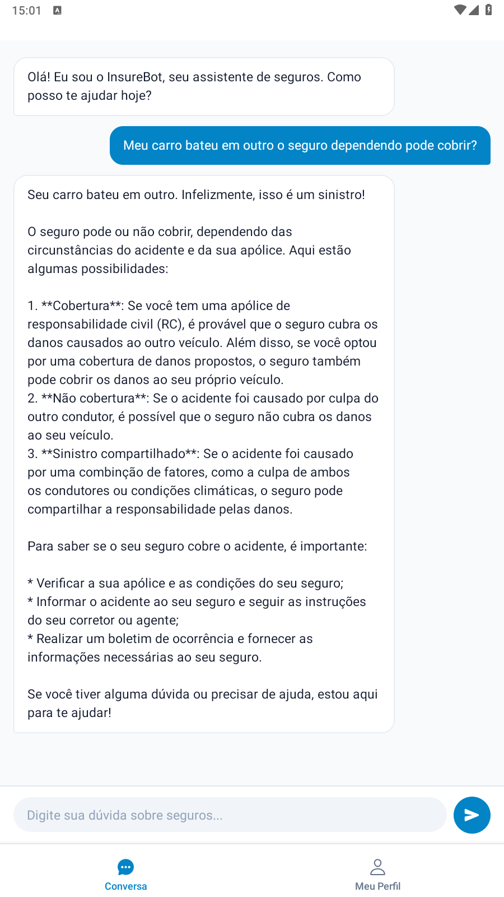
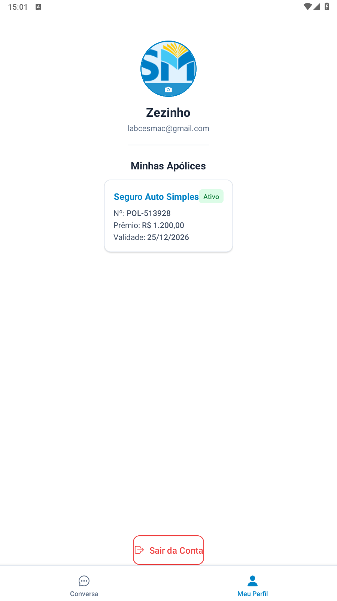

# InsureBot — Assistente de Seguros

> Aplicativo mobile de assistência em seguros com chat inteligente, autenticação e gestão de apólices. Desenvolvido com **React Native + Expo**, **Firebase** e **IA via Groq (Llama 3)**.


[Sobre](#sobre) • [Funcionalidades](#funcionalidades) • [Telas](#telas) • [Tecnologias](#tecnologias) • [Instalação](#instalação) • [Variáveis de Ambiente](#variáveis-de-ambiente) • [Estrutura](#estrutura-do-projeto)

---

## Sobre

O **InsureBot** é um aplicativo mobile desenvolvido para simplificar o acesso a informações sobre seguros. O usuário pode criar uma conta, visualizar suas apólices e conversar com um assistente de IA especializado em seguros — tudo em português do Brasil.

**Destaques:**

- 🤖 Chat com IA treinada para responder dúvidas sobre seguros (apólices, sinistros, coberturas)
- 🔐 Autenticação completa com Firebase Auth (login, cadastro e recuperação de senha)
- 📋 Perfil do usuário com listagem de apólices salvas no Firestore
- 📸 Upload de foto de perfil via câmera ou galeria
- ⚡ Engine Hermes para melhor performance no Android
- 📱 Suporte a Android (arm64, armeabi-v7a, x86, x86_64)

---

## Funcionalidades

| Funcionalidade | Descrição | Status |
|---|---|---|
| **Cadastro** | Criação de conta com nome, e-mail e senha | ✅ |
| **Login** | Autenticação com e-mail e senha via Firebase Auth | ✅ |
| **Recuperação de Senha** | Envio de e-mail de redefinição de senha | ✅ |
| **Chat com IA** | Conversa com o InsureBot (Llama 3.1 via Groq) | ✅ |
| **Perfil do Usuário** | Visualização de nome, e-mail e foto de perfil | ✅ |
| **Apólices** | Listagem de apólices vinculadas ao usuário no Firestore | ✅ |
| **Foto de Perfil** | Seleção de imagem pela câmera ou galeria | ✅ |
| **Persistência de Sessão** | Login salvo com AsyncStorage | ✅ |

---

## Telas

### 🔐 Login

Autenticação com e-mail e senha, com link direto para recuperação de senha.



---

### 📝 Cadastro

Registro de nova conta com nome, e-mail e senha. Os dados são salvos automaticamente no Firestore.



---

### 🔑 Recuperar Senha

Envio de e-mail de redefinição de senha via Firebase Auth.



---

### 💬 Chat

Tela principal após o login. O usuário conversa com o **InsureBot**, um assistente especializado em seguros que responde dúvidas sobre apólices, sinistros e coberturas em linguagem natural. O histórico da conversa é mantido durante a sessão e enviado como contexto para a IA a cada nova mensagem.



---

### 👤 Perfil

Exibe os dados do usuário (nome, e-mail e foto) e lista todas as apólices vinculadas à conta, buscadas diretamente do Firestore. Permite atualizar a foto de perfil pela câmera ou galeria.



---

## Tecnologias

| Categoria | Tecnologia | Versão | Para que serve |
|---|---|---|---|
| **Framework Mobile** | React Native | 0.81.5 | Base do aplicativo |
| **Plataforma** | Expo | ~54.0.33 | Build, desenvolvimento e distribuição |
| **Roteamento** | Expo Router | ~6.0.23 | Navegação entre telas (file-based routing) |
| **Linguagem** | TypeScript | ~5.9.2 | Tipagem estática |
| **Autenticação** | Firebase Auth | ^12.13.0 | Login, cadastro e recuperação de senha |
| **Banco de Dados** | Firebase Firestore | ^12.13.0 | Dados dos usuários e apólices |
| **Persistência** | AsyncStorage | 2.2.0 | Manutenção da sessão do usuário |
| **IA** | Groq API (Llama 3.1-8b-instant) | — | Assistente de chat sobre seguros |
| **Ícones** | @expo/vector-icons | ^15.0.3 | Ícones da interface |
| **Imagens** | expo-image-picker | ~17.0.11 | Seleção de foto de perfil |
| **Navegação** | React Navigation (Tabs + Drawer) | ^7.x | Navegação por abas e gaveta |
| **Animações** | react-native-reanimated | ~4.1.1 | Animações fluidas |
| **Engine JS** | Hermes | — | Performance otimizada no Android |

---

## Instalação

### Pré-requisitos

- [Node.js](https://nodejs.org/) 18 ou superior
- [Expo CLI](https://docs.expo.dev/get-started/installation/) instalado globalmente
- Conta no [Firebase](https://firebase.google.com/) com projeto configurado
- Chave de API da [Groq](https://console.groq.com/)
- Dispositivo físico ou emulador Android/iOS

### Passo a passo

```bash
# 1. Clone o repositório
git clone https://github.com/luizedu94/insurebot.git
cd insurebot

# 2. Instale as dependências
npm install

# 3. Configure as variáveis de ambiente
cp .env.example .env
# Edite o .env com suas chaves (veja a seção abaixo)

# 4. Inicie o servidor de desenvolvimento
npx expo start

# Para rodar diretamente no Android
npx expo start --android

# Para rodar diretamente no iOS
npx expo start --ios
```

---

## Variáveis de Ambiente

Crie um arquivo `.env` na raiz do projeto com as seguintes variáveis:

```env
# Firebase
EXPO_PUBLIC_FIREBASE_API_KEY=sua_api_key
EXPO_PUBLIC_FIREBASE_AUTH_DOMAIN=seu_projeto.firebaseapp.com
EXPO_PUBLIC_FIREBASE_PROJECT_ID=seu_projeto
EXPO_PUBLIC_FIREBASE_STORAGE_BUCKET=seu_projeto.appspot.com
EXPO_PUBLIC_FIREBASE_MESSAGING_SENDER_ID=seu_sender_id
EXPO_PUBLIC_FIREBASE_APP_ID=seu_app_id

# Groq (IA)
EXPO_PUBLIC_GROQ_API_KEY=sua_chave_groq
```

> **Atenção:** Nunca suba o arquivo `.env` para o repositório. Ele já está no `.gitignore`.

---

## Estrutura do Projeto

```
insurebot/
├── assets/                  # Ícones e splash screen do app
├── src/
│   ├── app/
│   │   ├── acesso/          # Telas de login, cadastro, recuperar senha e sobre
│   │   │   ├── login.tsx
│   │   │   ├── register.tsx
│   │   │   ├── recuperar.tsx
│   │   │   ├── sobre.tsx
│   │   │   └── _layout.tsx
│   │   ├── usuario/         # Telas autenticadas (chat e perfil)
│   │   │   ├── chat.tsx
│   │   │   ├── profile.tsx
│   │   │   └── _layout.tsx
│   │   ├── index.tsx        # Tela inicial / redirecionamento
│   │   └── _layout.tsx      # Layout raiz
│   ├── assets/              # Logos e imagens internas
│   ├── config/
│   │   └── firebase.ts      # Inicialização do Firebase
│   ├── services/
│   │   └── firestoreService.ts  # Funções de acesso ao Firestore
│   └── styles/
│       ├── global.tsx       # Estilos globais
│       ├── acesso.tsx       # Estilos das telas de acesso
│       └── usuario.tsx      # Estilos das telas autenticadas
├── app.json                 # Configuração do Expo
├── eas.json                 # Configuração do EAS Build
├── tsconfig.json            # Configuração do TypeScript
└── .env                     # Variáveis de ambiente (não versionar)
```

---

## Build para Android

O projeto usa o **EAS Build** para gerar o APK/AAB:

```bash
# Instalar EAS CLI
npm install -g eas-cli

# Login na conta Expo
eas login

# Build APK para Android (preview)
eas build --platform android --profile preview

# Build AAB para produção (Play Store)
eas build --platform android --profile production
```

> O APK gerado suporta as arquiteturas **arm64-v8a**, **armeabi-v7a**, **x86** e **x86_64**, compatível com Android 7.0+ (API 24).

---

## Contribuição

1. Faça um **Fork** do projeto
2. Crie uma **Branch** (`git checkout -b feature/MinhaFeature`)
3. Faça o **Commit** (`git commit -m 'feat: MinhaFeature'`)
4. Faça o **Push** (`git push origin feature/MinhaFeature`)
5. Abra um **Pull Request**

---

## Licença

Este projeto está licenciado sob a [MIT License](LICENSE).

---

Desenvolvido por **Luiz Eduardo**  
[GitHub](https://github.com/luizedu94)
